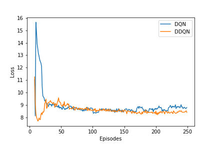

# multi-echleon-supply-chain-rl
 Reinforcement Learning for solving Multi Echleon Supply chain problem

The multi echleon inventory optimization is complex problem to stock the different stages of supply chain. Each decision on the higher stage of the supply chain can affect the decisions made in the lower level. 

DQN and DDQN Implementation for solving the problem has been added now

The comparison of loss between both the startegies are shown below

</img>

Policy gradient based techniques will be added soon!
